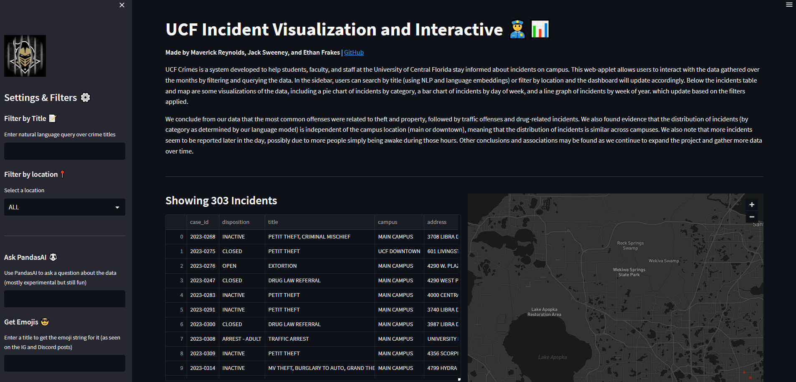
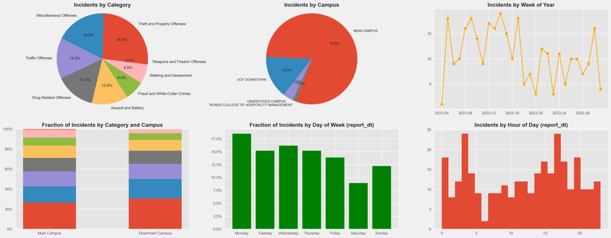

# UCF Crimes

UCF Crimes is a project create by Maverick Reynolds, Jack Sweeney, and Ethan Frakes. Our system gathers data from the UCFPD daily crime log and posts information to Instagram and Discord. Incidents are made public according to the Clery Act, a federal law that requires all U.S. colleges and universities (including foreign campuses of U.S. institutions), both public and private, participating in federal student aid programs to maintain and disclose certain crime statistics and campus security/fire information. All information republished by UCF Crimes is gathered directly from the UCFPD daily crime log, and no erronous or false information is injected into the posts.

This repository is a simple Streamlit interface that allows users to see, and interact with the first three hundred incidents in the database. Users can search by title and filter by location while seeing a map of the incidents and summary statistics and charts update in real time.

## Future Integrations
- SQL Queries through our Postgres Database
- Continual generation of 'title' embeddings for semantic search

## Notes
- UCF Crimes is not affiliated with UCFPD
- UCF Crimes is not created with malicioius intent
- UCF Crimes does not encourage malicious behavior of any kind

## Connect
- IG: [@ucfcrimes](https://www.instagram.com/ucfcrimes)
- Discord: [UCF Crimes](https://discord.gg/NEEbsbu8Np)

## Other Repositories
- [DiscordBot](https://github.com/mavreyn/UCF-Crimes-Discord) (The UCF Crimes Discord has ability to query over dates and locations. More options will be available in the future.)

